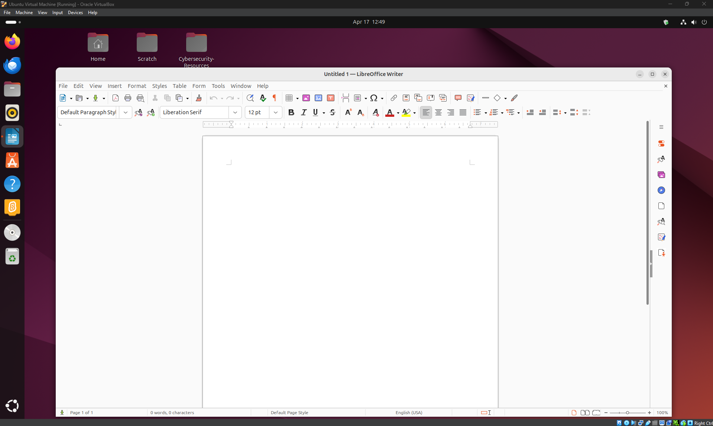
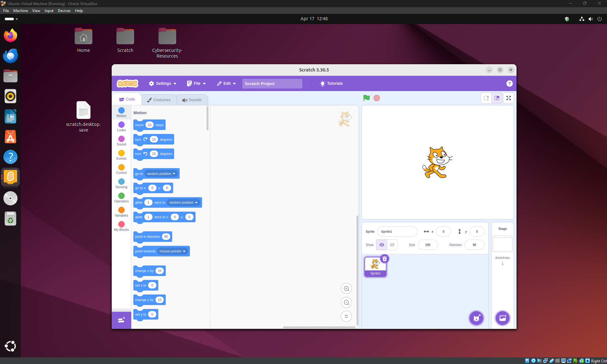
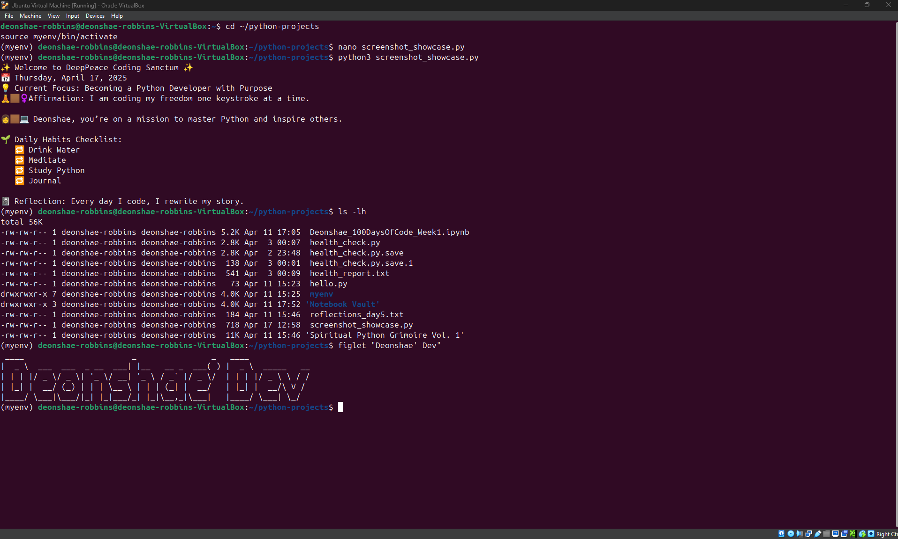

# 🖥️ Virtual PC Build | Capstone Project

This is a hands-on capstone project completed as part of the [Diversity Cyber Council](https://diversitycybercouncil.com/) CompTIA Tech+ Career Readiness Program.

In this build, I used **Oracle VirtualBox** to design and configure a virtual PC, simulate hardware selection, install Ubuntu 20.04, and run a functional OS environment.

---

## 🔧 Tools Used

- Oracle VirtualBox
- Ubuntu 20.04 LTS (ISO)
- Guest Additions (for seamless VM experience)
- Visual Studio Code
- LibreOffice
- Scratch
- Python 3 (pre-installed + demoed)

---

<h2 align="center">📸 Screenshots</h2>

   
  <em>Virtual PC Desktop (Ubuntu)</em>

   
  <em>LibreOffice Installed</em>

   
  <em>Scratch Installed</em>

   
  <em>Python 3 Environment</em>

---

## 🧱 Build Steps

1. Defined system purpose and performance goals (general use + dev tools)
2. Selected and configured virtual hardware (CPU, RAM, Disk)
3. Downloaded Ubuntu 20.04 ISO and installed it on a VirtualBox VM
4. Set up system tools (LibreOffice, Scratch, VS Code, Python 3)
5. Evaluated performance using System Monitor
6. Documented the full build process and created a video walkthrough

---

## 🎥 Video Walkthrough

▶️ [Watch on YouTube](https://youtu.be/q5U1yy0Wv3c)

---

## 💡 Lessons Learned

- Built confidence using virtualization tools and configuring virtual hardware
- Practiced system installation, optimization, and troubleshooting
- Reinforced core IT support concepts through real-world simulation
- Improved documentation and technical presentation skills

---

📊 Presentation Deck
You can view the full visual presentation of this project here:

🎨 Live Presentation Deck (Week 6 – Virtual PC Build)
https://team1dcc.my.canva.site/virtual-pc-build-week-6

This slide deck outlines the project scope, component selection, build steps, performance evaluation, and reflections. It was created as a final deliverable to present technical understanding and communication skills as part of the Week 6 capstone assignment in the CompTIA Tech+ Career Readiness Cohort.

---

## 🔗 Connect With Me

- 💼 [LinkedIn](https://www.linkedin.com/in/deonshaerobbins)
- 📧 robbins.deonshae@outlook.com
- 🧠 [The AI Hustle Blueprint YouTube Channel](https://www.youtube.com/@TheAIHustleBlueprint)

---

> 🌱 **This is part of my public tech portfolio. Follow my journey into roles in IT Support, Cloud, and Cybersecurity.**
