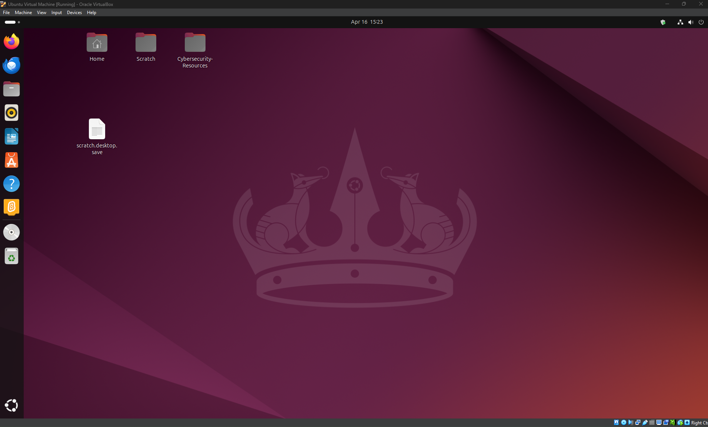

# 🖥️ Virtual PC Build | Capstone Project

This is a hands-on capstone project completed as part of the [Diversity Cyber Council](https://diversitycybercouncil.com/) CompTIA Tech+ Career Readiness Program.

In this build, I used **Oracle VirtualBox** to design and configure a virtual PC, simulate hardware selection, install Ubuntu 20.04, and run a functional OS environment.

---

## 🔧 Tools Used

- Oracle VirtualBox
- Ubuntu 20.04 LTS (ISO)
- Guest Additions (for seamless VM experience)
- Visual Studio Code (installed post-build)

---

## 📸 Screenshots

> *More available in the `screenshots/` folder*

---

## 🧱 Build Steps

1. Defined build purpose and requirements (general use + dev tools)
2. Selected and configured virtual hardware (CPU, RAM, Disk)
3. Downloaded and installed Ubuntu 20.04 via ISO
4. Configured OS settings and installed developer tools
5. Evaluated performance using System Monitor
6. Documented and recorded the full walkthrough

---

## 🎥 Video Walkthrough

▶️ [Watch on YouTube](https://youtu.be/q5U1yy0Wv3c)

---

## 💡 Lessons Learned

- Gained confidence using VirtualBox and configuring VMs
- Practiced OS installation, system troubleshooting, and RAM/CPU allocation
- Reinforced foundational IT skills applicable to real-world helpdesk roles
- Learned the importance of documenting and presenting technical work

---

## 🔗 Connect With Me

- 💼 [LinkedIn](https://www.linkedin.com/in/deonshaerobbins)
- 📧 robbins.deonshae@outlook.com
- 🧠 [The AI Hustle Blueprint YouTube Channel](https://www.youtube.com/@TheAIHustleBlueprint)

---

> 🌱 **This is part of my public tech portfolio. Follow my journey as I grow into roles in IT Support, Cloud, and Cybersecurity.**
